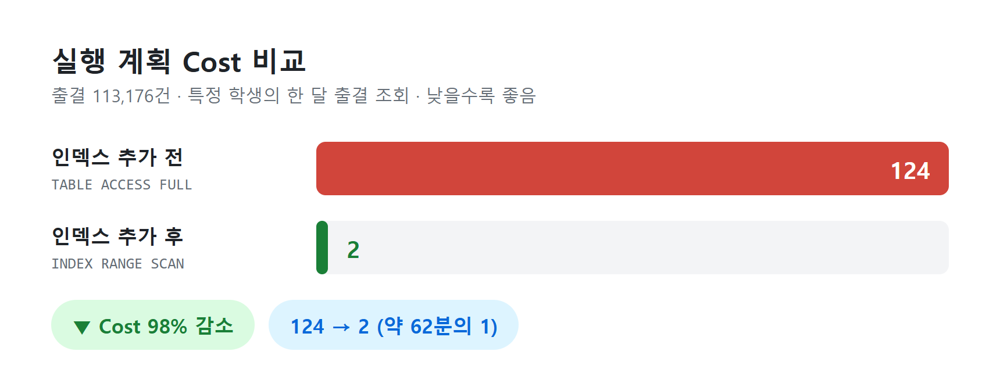
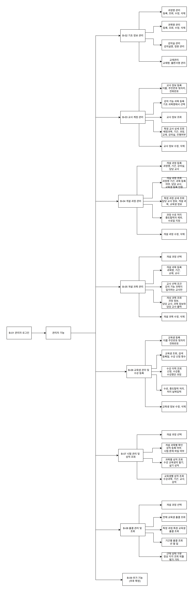
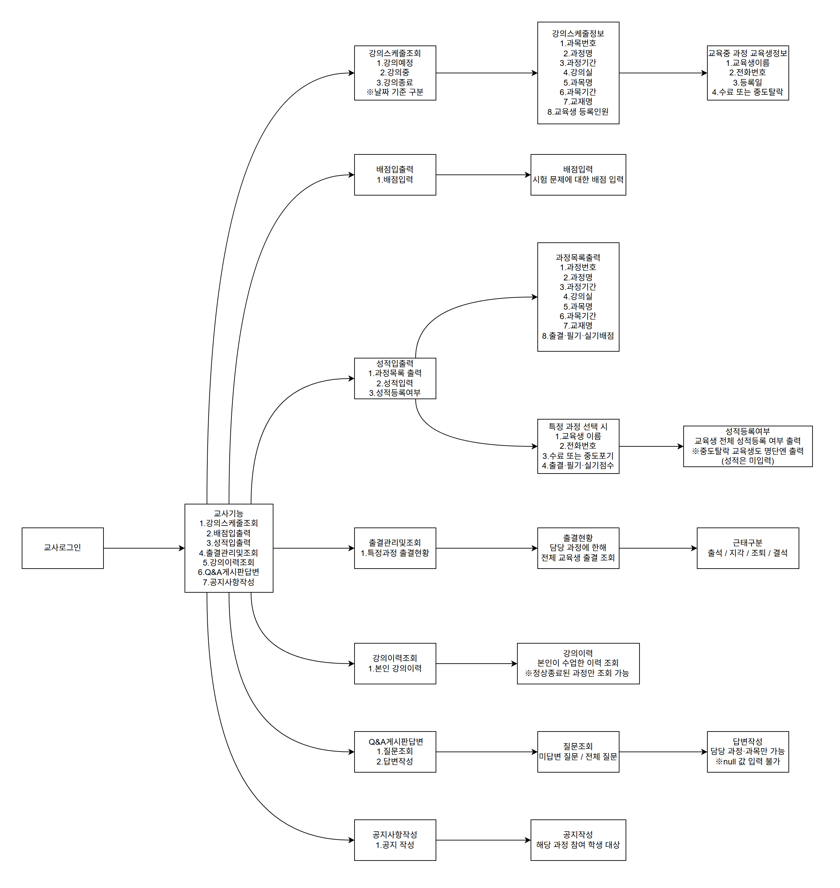
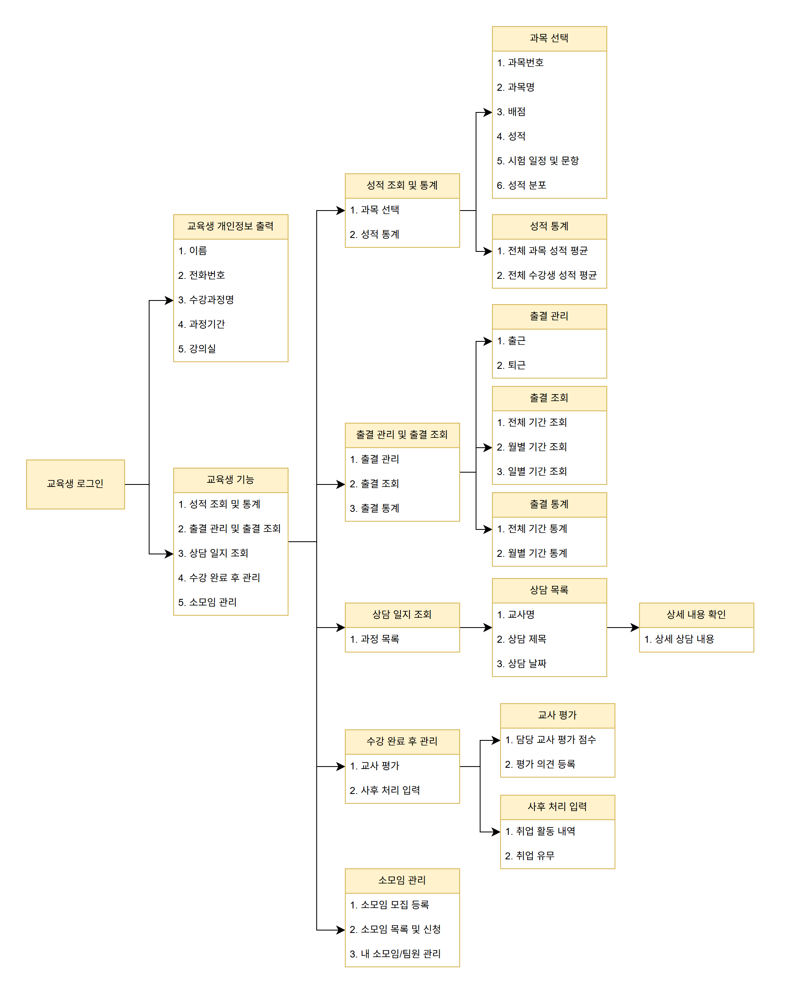
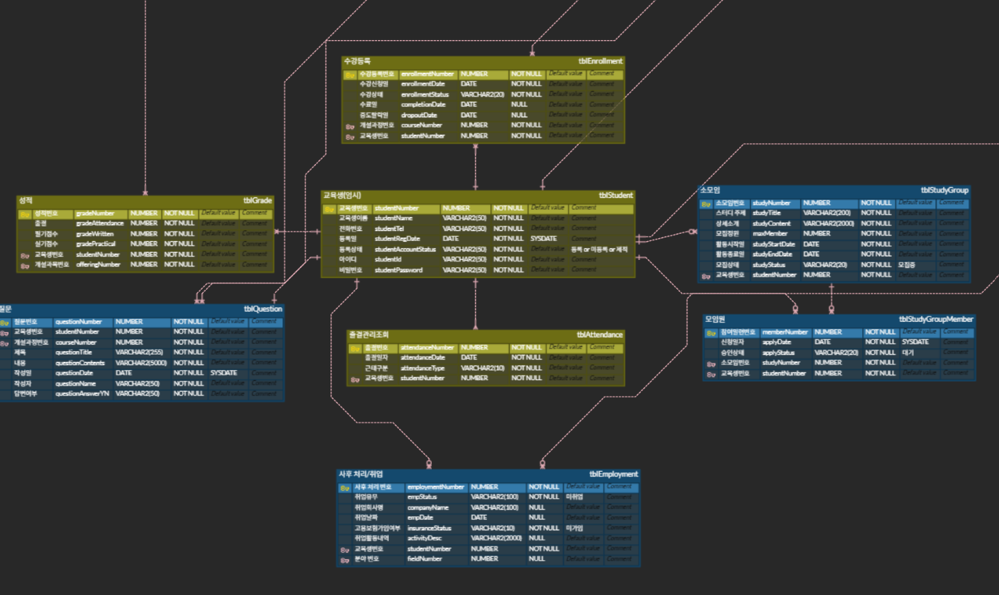
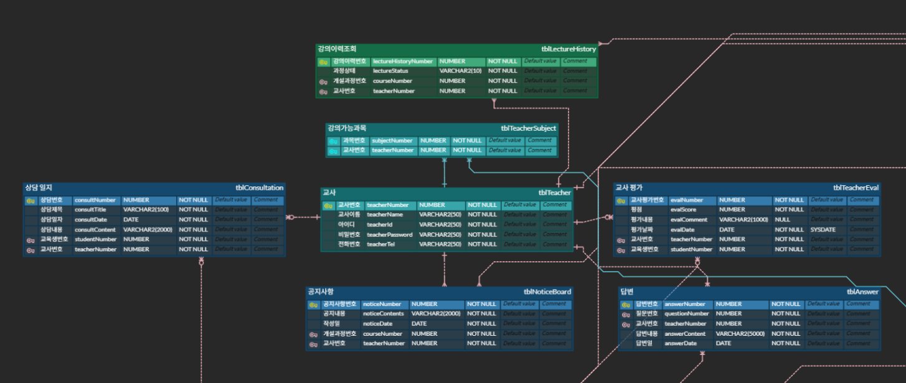
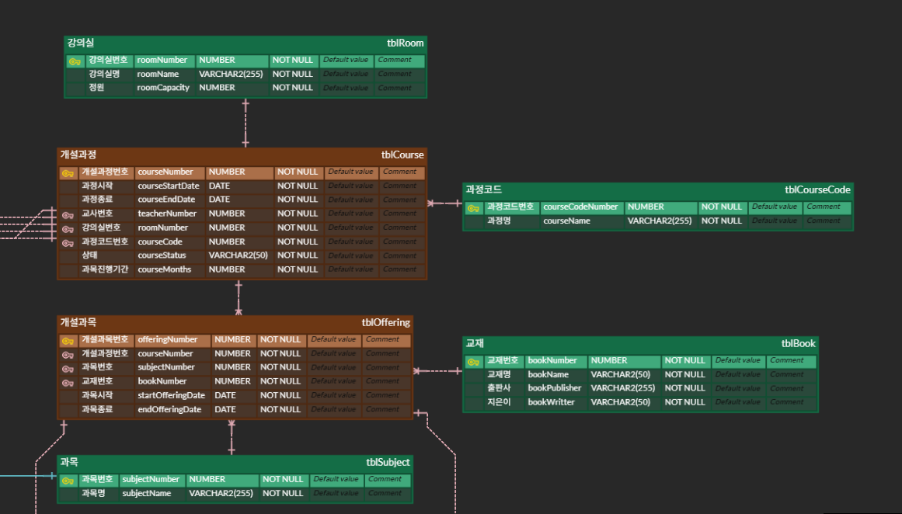
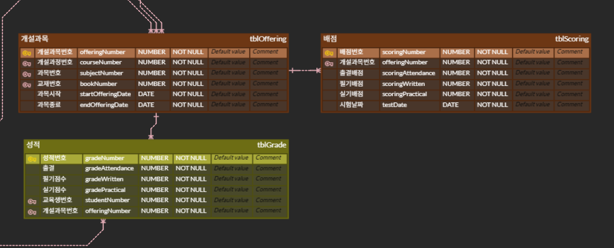

# 🏫 교육센터 관리 시스템 DB (Edu Center DB)

교육센터 운영에 필요한 계정, 교육과정·과목, 교사·교육생, 성적·출결, 부가 기능(상담, 소모임, Q&A, 공지사항)을 관리하는 **Oracle 기반 데이터베이스 설계 및 구현 프로젝트**입니다.

## 👥 팀원

김상준 · 권익성 · 최유빈 · 이동희 · 김요한

## 📅 개발 기간

5일 (2026년 8월)

## 🛠 개발 환경 및 기술

| 구분 | 내용 |
|---|---|
| DBMS | Oracle Database 21c |
| Language | ANSI-SQL, PL/SQL |
| Tools | SQL Developer, DataGrip, ERDCloud, draw.io |

## 🙋 담당 업무

**조장**으로 프로젝트를 총괄하고, DB 환경 구축과 전체 문서 통합을 맡았습니다.

### 테이블 설계 (DDL)

| 테이블 | 설명 |
|---|---|
| `tblStudent` | 교육생 |
| `tblOffering` | 개설과목 |
| `tblAttendance` | 출결관리조회 |
| `tblScoring` | 배점 |
| `tblTeacherSubject` | 강의가능과목 (교사-과목 매핑) |

### 더미 데이터 (DML)

AI를 활용해 테이블별 더미 데이터를 직접 생성했습니다.

| 데이터 | 건수 |
|---|---|
| 출결 | **113,176** |
| 과목 / 강의가능과목 매핑 / 개설과목 | 101 / 79 / 52 |
| 과정코드 / 강의이력 / 공지사항 | 36 / 36 / 30 |
| 분야 / 강의실 / 관리자 | 10 / 6 / 5 |

### 품질 점검

FK·ALTER 작성 표준을 정리하고, 동시성·트랜잭션·데이터 무결성·인덱스 점검을 진행했습니다. (아래 [점검 사항](#-점검-사항) 참고)

### DB 오브젝트

조회 성능 확보를 위한 인덱스와, 자주 쓰는 조회·계산·트랜잭션 로직을 뷰·함수·프로시저로 정리했습니다.

| 구분 | 이름 | 설명 |
|---|---|---|
| 인덱스 | `idx_attendance_student` 외 10개 | FK 조인용, 검색·필터 조건용, 복합 인덱스 |
| 뷰 | `vwStudentAttendanceRate` | 학생별 출석률 집계 |
| 뷰 | `vwStudentCourseStatus` | 학생별 수강 과정 현황 |
| 뷰 | `vwCourseEnrollmentSummary` | 과정별 수강신청 인원 집계 |
| 함수 | `fnCalcTotalScore` | 출석 20% + 필기 40% + 실기 40% 총점 계산 |
| 함수 | `fnGetAttendanceRate` | 특정 학생의 출석률 조회 |
| 프로시저 | `prcEnrollStudent` | 수강 신청 처리 (중복 등록 방지) |
| 프로시저 | `prcCheckAttendance` | 당일 출결 등록 (중복 출결 방지) |

> ⚡ 출결 기간 조회용 복합 인덱스로 **조회 비용(Cost)을 124 → 2로 줄였습니다.** ([성능 개선](#-성능-개선-복합-인덱스로-조회-비용-98-감소) 참고)

## ⚡ 성능 개선: 복합 인덱스로 조회 비용 98% 감소

출결 데이터 **113,176건**에서 특정 학생의 기간별 출결을 조회하는 쿼리에 복합 인덱스를 적용하고, 실행 계획을 비교했습니다.



| | 인덱스 추가 전 | 인덱스 추가 후 |
|---|---|---|
| 접근 방식 | `TABLE ACCESS FULL` | `INDEX RANGE SCAN` → `TABLE ACCESS BY INDEX ROWID BATCHED` |
| 조건 처리 | `filter`: 모든 행을 읽은 뒤 조건으로 걸러냄 | `access`: 인덱스로 필요한 행에 바로 접근 |
| **Cost** | **124** | **2** (약 **62배 감소**) |

### 대상 쿼리

```sql
SELECT attendanceDate, attendanceType
  FROM tblAttendance
 WHERE studentNumber = 100
   AND attendanceDate BETWEEN DATE '2026-06-01' AND DATE '2026-06-30'
 ORDER BY attendanceDate;
```

### 복합 인덱스로 만든 이유

`studentNumber` 단일 인덱스만 있으면 한 학생의 전체 출결은 빨리 찾지만, 그중 **특정 기간**의 출결은 다시 걸러내야 합니다. `attendanceDate`를 함께 묶은 복합 인덱스를 만들어 학생 + 기간 조회를 한 번에 처리하도록 했습니다.

```sql
CREATE INDEX idx_attendance_student_date
    ON tblAttendance(studentNumber, attendanceDate);
```

### 컬럼 순서: `studentNumber` → `attendanceDate`

- `studentNumber`는 학생 고유 번호라 값의 종류가 많아 **한 번에 범위를 크게 좁힐 수 있습니다.**
- `attendanceDate`는 같은 날짜에 여러 학생의 데이터가 몰려 있어 앞에 두면 범위를 좁히는 효과가 작습니다.
- 또한 `=` 조건 컬럼을 앞에, `BETWEEN` 범위 조건 컬럼을 뒤에 두어야 인덱스를 끝까지 효율적으로 탈 수 있습니다.

<details>
<summary>실행 계획 원문 보기</summary>

**인덱스 추가 전**

```
-----------------------------------------------------------------------------------
| Id  | Operation         | Name          | Rows  | Bytes | Cost (%CPU)| Time     |
-----------------------------------------------------------------------------------
|   0 | SELECT STATEMENT  |               |    23 |   437 |   124   (2)| 00:00:01 |
|*  1 |  TABLE ACCESS FULL| TBLATTENDANCE |    23 |   437 |   124   (2)| 00:00:01 |
-----------------------------------------------------------------------------------
   1 - filter("STUDENTNUMBER"=100 AND "ATTENDANCEDATE">=TO_DATE('2026-06-01 00:00:00', 'syyyy-mm-dd hh24:mi:ss')
              AND "ATTENDANCEDATE"<=TO_DATE('2026-06-30 00:00:00', 'syyyy-mm-dd hh24:mi:ss'))
```

**인덱스 추가 후**

```
-------------------------------------------------------------------------------------------------------------------
| Id  | Operation                           | Name                        | Rows  | Bytes | Cost (%CPU)| Time     |
-------------------------------------------------------------------------------------------------------------------
|   0 | SELECT STATEMENT                    |                             |    23 |   437 |     2   (0)| 00:00:01 |
|   1 |  TABLE ACCESS BY INDEX ROWID BATCHED| TBLATTENDANCE               |    23 |   437 |     2   (0)| 00:00:01 |
|*  2 |   INDEX RANGE SCAN                  | IDX_ATTENDANCE_STUDENT_DATE |    23 |       |     1   (0)| 00:00:01 |
-------------------------------------------------------------------------------------------------------------------
   2 - access("STUDENTNUMBER"=100 AND "ATTENDANCEDATE">=TO_DATE('2026-06-01 00:00:00', 'syyyy-mm-dd hh24:mi:ss')
              AND "ATTENDANCEDATE"<=TO_DATE('2026-06-30 00:00:00', 'syyyy-mm-dd hh24:mi:ss'))
```

</details>

## ✨ 주요 요구사항

| 사용자 | 기능 |
|---|---|
| **관리자** | 기초 정보 관리, 교사 계정 관리, 개설 과정·과목 관리, 교육생·수강 등록 관리, 성적·출결 조회 |
| **교사** | 강의 스케줄 조회, 배점·성적 입력, 출결 관리, Q&A 답변, 공지사항 작성 |
| **교육생** | 성적·출결 조회, 교사 평가 및 취업 정보 등록, 상담일지 조회, 소모임, Q&A 질문 |

### 사용자별 순서도

<details>
<summary><b>관리자</b> 순서도 보기</summary>



</details>

<details>
<summary><b>교사</b> 순서도 보기</summary>



</details>

<details>
<summary><b>교육생</b> 순서도 보기</summary>



</details>

## 🗂 데이터 구조

- **24개 테이블, 123개 컬럼**
- 테스트 데이터: 관리자 5명, 교사 10명, 교육생 168명, 과목 101개, 과정 36개, 출결 약 11만 건


### 영역별 ERD

| 교육생 | 교사 |
|---|---|
|  |  |

| 과정 · 과목 | 시험 · 성적 |
|---|---|
|  |  |

## 🔍 점검 사항

### 1. 동시성 제어: 출결 상태 동시 수정

- **문제**: 두 세션이 같은 출결 데이터를 동시에 수정하면, 나중에 COMMIT한 값이 먼저 수정한 값을 덮어써 데이터가 유실됨 (Lost Update)
- **원인**: 두 세션이 같은 행을 조회한 뒤 각자 수정하고 COMMIT하는데, 상대 세션의 변경 여부를 확인하지 않아 마지막 COMMIT만 남음

  | 순서 | 세션 1 | 세션 2 |
  |---|---|---|
  | 1 | SELECT (조회) | SELECT (조회) |
  | 2 | UPDATE → '지각' | |
  | 3 | | UPDATE → '결석' |
  | 4 | COMMIT | |
  | 5 | | COMMIT |

  → 세션 1은 '지각'을 기대했지만 결과는 '결석'으로, 세션 1의 수정이 사라짐

- **해결 방안 비교**

  | 방법 | 장점 | 단점 |
  |---|---|---|
  | 원자적 DML | 조회 + 검증 + 변경을 한 SQL로 처리 | 실패해도 에러 없이 0건 처리됨 |
  | **낙관적 락** | 동시 조회 성능이 좋음 | 충돌이 잦으면 재시도가 계속 실패 |
  | 제약조건 | 가장 강력하고 우회 불가능 | 같은 행 안의 값끼리만 비교 가능 |

- **적용: 낙관적 락**. 버전 번호 컬럼을 추가하고, 수정할 때 버전까지 함께 검증하는 방식을 선택했습니다.

#### 🔥 트러블슈팅: 버전 컬럼을 추가했는데도 해결되지 않았던 문제

1. **시도**: `ALTER TABLE`로 버전 관리용 컬럼(`VERSION_NO`)을 추가하고, `UPDATE`의 `WHERE` 절에 버전 조건을 넣었습니다.
2. **문제 발생**: 그런데도 동시 수정 테스트에서 충돌이 감지되지 않아, **동시성 문제가 그대로 재현**됐습니다.
3. **원인 분석**: 코드와 쿼리를 여러 번 다시 확인해도 원인을 찾지 못해 공식 문서와 자료를 직접 찾아본 끝에, **Oracle 12c 이상에서는 `DEFAULT` 값이 있는 컬럼을 `ALTER`로 추가하면 기존 행에 값이 실제로 기록되지 않고 메타데이터(데이터 딕셔너리)로만 관리된다**는 점을 알게 됐습니다.
4. **해결**: `UPDATE`로 기존 행 전체에 버전 값을 **실제 물리 데이터로 반영**한 뒤 다시 테스트했고, 충돌이 정상적으로 감지됐습니다.

```sql
-- 1. 버전 관리용 컬럼 추가
ALTER TABLE tblAttendance ADD VERSION_NO NUMBER DEFAULT 0 NOT NULL;

-- 2. ⭐ Oracle 12c+는 ALTER 시 메타데이터에만 값이 들어가므로, 실제 데이터에 반영
UPDATE tblAttendance SET VERSION_NO = VERSION_NO;

-- 3. 수정 시 버전 번호까지 함께 검증
UPDATE tblAttendance
   SET attendanceType = '지각', VERSION_NO = VERSION_NO + 1
 WHERE attendanceNumber = 3 AND VERSION_NO = 0;
-- 다른 세션이 먼저 커밋해 VERSION_NO가 바뀌었다면 0건 UPDATE → 충돌 감지
```

> 💡 **배운 점**: SQL 문법이 맞더라도 DBMS가 내부적으로 데이터를 어떻게 저장하는지 모르면 예상과 다르게 동작할 수 있다는 것을 배웠습니다. 문제가 풀리지 않을 때 원인을 끝까지 파고드는 습관의 중요성도 느꼈습니다.

- **결과**: 해결 후 재시험에서 예상(결석) = 실제(결석)로 정상 동작 확인

### 2. 무결성 검사: 핵심 업무 규칙의 DB 레벨 적용

- **문제**: 성적 범위, 과정 기간, 질문-답변 관계 등 핵심 업무 규칙이 DB 레벨에서 실제로 강제되는지 불확실함
- **원인**: 설계 초기에는 규칙이 애플리케이션 로직에서만 걸러질 수 있어, DB 자체 검증 여부를 따로 점검할 필요가 있었음
- **해결**: 핵심 업무 규칙 5가지를 DB 제약조건으로 적용했는지 점검 → **5개 모두 적용 확인**

  | 업무 규칙 | 제약조건 |
  |---|---|
  | 성적은 0~100점 범위 | `CHECK` |
  | 과정 시작일 ≤ 종료일 | `CHECK` |
  | 질문 1개당 답변 1개 | `UNIQUE` |
  | 학생 아이디 중복 불가 | `UNIQUE` |
  | 계정 상태값 제한 | `CHECK` |

  ```sql
  ALTER TABLE tblGrade ADD CONSTRAINT ck_grade_range
      CHECK (gradeWritten BETWEEN 0 AND 100 AND gradePractical BETWEEN 0 AND 100);

  ALTER TABLE tblCourse ADD CONSTRAINT ck_course_date
      CHECK (courseStartDate <= courseEndDate);

  ALTER TABLE tblAnswer ADD CONSTRAINT uq_answer_question
      UNIQUE (questionNumber);
  ```

### 3. 트랜잭션: 신입생 등록 → 수강 등록

- **문제**: 신입생 등록 후 수강 신청이 실패하면, 수강 과정이 없는 "유령 학생" 데이터가 남음
- **원인**: 두 INSERT를 하나의 트랜잭션으로 묶지 않아, 학생 등록만 성공하고 수강 신청이 실패해도 학생 등록이 그대로 커밋됨
- **해결**: 신입생 등록부터 수강 등록까지 하나의 트랜잭션으로 처리하고, 오류가 나면 `ROLLBACK`으로 학생 등록까지 모두 취소

  ```sql
  INSERT INTO tblStudent VALUES (170, '아무개', '010-1597-1597', TRUNC(SYSDATE), '등록', 'student170', 4381975);
  INSERT INTO tblEnrollment VALUES (339, TRUNC(SYSDATE), '수강중', NULL, NULL, 38, 170);
  -- 38번 과정이 존재하지 않아 오류 발생
  --   tblStudent    : 170번 행이 그대로 남음 (X)
  --   tblEnrollment : 저장 안 됨

  ROLLBACK;  -- 학생 정보까지 전부 취소
  ```

  재실행할 때 학생번호(PK) 중복이 발생하므로, 반드시 `ROLLBACK`한 뒤 다시 시도해야 합니다.

## 📁 산출물

| 단계 | 파일 |
|---|---|
| 1. 요구분석서 | [요구분석서.pdf](<1. 요구분석서/1. 요구분석서.pdf>) |
| 2. 순서도 | 관리자 / 교사 / 교육생 순서도 (`.drawio`) |
| 3. ERD | [전체 ERD.png](<3. ERD/전체 ERD.png>) |
| 4. 테이블 정의서 | [테이블 정의서(DDL).pdf](<4. 테이블 정의서/4. 테이블 정의서(DDL).pdf>) |
| 5. 데이터 정의서 | [데이터정의서DML.sql](<5. 데이터 정의서/5. 데이터정의서DML.sql>) |
| 6. 쿼리 정의서 | [쿼리문_정의서_최종통합본.pdf](<6. 쿼리정의서/쿼리문_정의서_최종통합본.pdf>) |
| 7. DB 오브젝트 | [DB 오브젝트.pdf](<7. DB오브젝트/7.  DB 오브젝트.pdf>) |
| 8. 발표 자료 | [교육센터 관리 시스템.pdf](<8. PPT/교육센터 관리 시스템.pdf>) |

## 💬 프로젝트 후기

초기 ERD 작성과 DB 설계 과정에 정말 많은 신경과 노력을 쏟았지만, 실제 구현 과정에서 설계와 어긋나는 부분이 생겨 많이 아쉬웠습니다. 이 경험으로 **생각했던 것보다 더 많은 시간과 노력을 초기 설계에 투자해야 구현 단계가 원활하게 진행된다**는 것을 느꼈습니다.

또한 팀원들의 소중함을 느낀 프로젝트였습니다. 함께 만들어 가는 과정에서 **회의를 통해 서로 소통하며 일을 진행하는 것**이 무엇보다 중요하다는 것을 배웠습니다.
